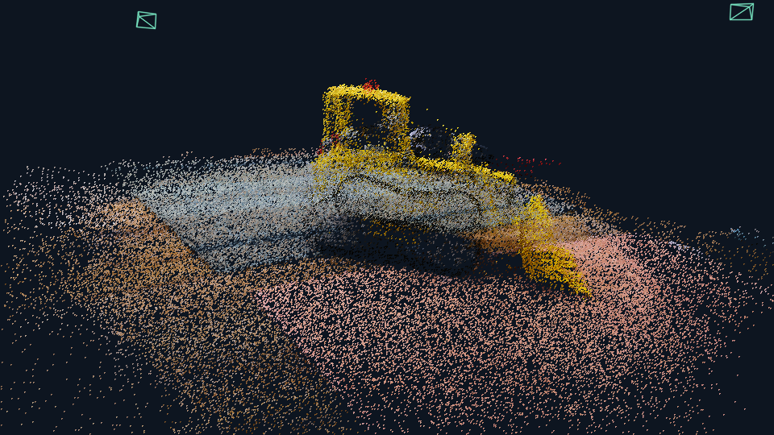

# 视觉几何基础模型与 3DGS 稠密三维重建

本项目研究 VGGT 与 3D Gaussian Splatting 的结合。已跑通多视图 RGB 输入、深度与相机预测、初始点云与 COLMAP 导出、Gaussian 优化及渲染的简化基线。

**接手开发请先阅读 [AGENTS.md](AGENTS.md)、[课题说明.md](课题说明.md) 和 [HANDOFF.md](HANDOFF.md)。**

## 当前结果

| 场景 | 视图 | Gaussian 数 | 训练步数 | 训练视角 PSNR | 训练视角 LPIPS-Alex v0.1 |
|---|---:|---:|---:|---:|---:|
| VGGT 官方 kitchen 工程车 | 12 | 80,000 | 12,000 | 20.77 dB | 0.1851 |
| 自采静态网球 | 9 | 200,000 | 12,000 | 36.56 dB | 0.0132 |

这些是训练视角拟合诊断，不能作为独立测试、新视角质量或几何精度成绩。两个场景设置不同，不能将分数差异视作改进方法的提升。当前固定相机、固定 Gaussian 数量、零阶颜色，没有标准 3DGS 的完整增密流程。



## 获取与复现

```powershell
git clone --recurse-submodules https://github.com/qzqzqzqzqzq/kc2.git
cd kc2
python baseline_demo/scripts/setup_sources.py
```

第三方源代码通过 submodule 固定提交；初始化脚本应用 pycolmap 兼容补丁。Python 3.11、CUDA、PyTorch 与 gsplat 的安装和完整命令见 [HANDOFF.md](HANDOFF.md)。

仓库包含两个最终场景的 RGB 输入、几何缓存、COLMAP 文件、Gaussian 参数、PLY、渲染图、指标和关键日志。VGGT 预训练权重需从官方另行下载；不包含环境安装包、完整 TUM 数据集、视频及历史 PPT。

## 主要入口

- [实验清单](baseline_demo/experiment_manifest.json)：版本、权重哈希、硬件及工程车参数。
- [基线运行说明](baseline_demo/README.md)：原始 Windows 运行记录。
- [失败与修正](baseline_demo/失败与修正.md)：环境问题与视觉伪影。
- [LPIPS 报告](baseline_demo/评估结果/LPIPS/LPIPS评估报告.md)：计算口径、逐视角结果及校验。

后续优先建立公开数据集的独立测试流程，再开展置信度初始化等改进与消融。第三方代码及数据遵循各自上游许可；本仓库不替第三方授予许可。
